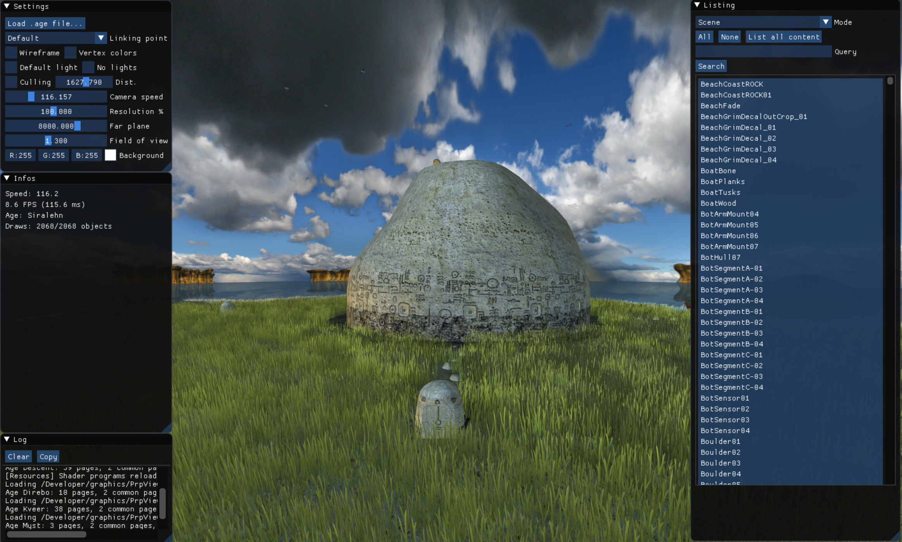
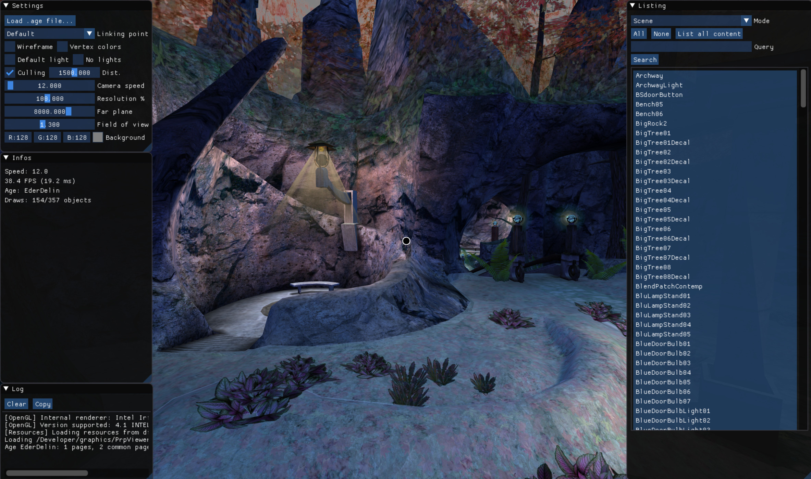
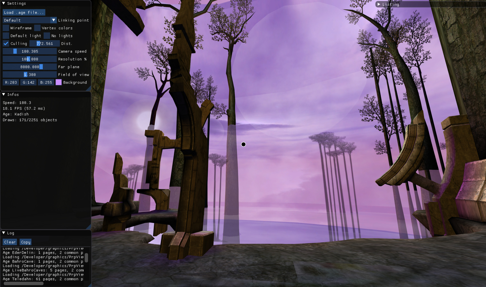
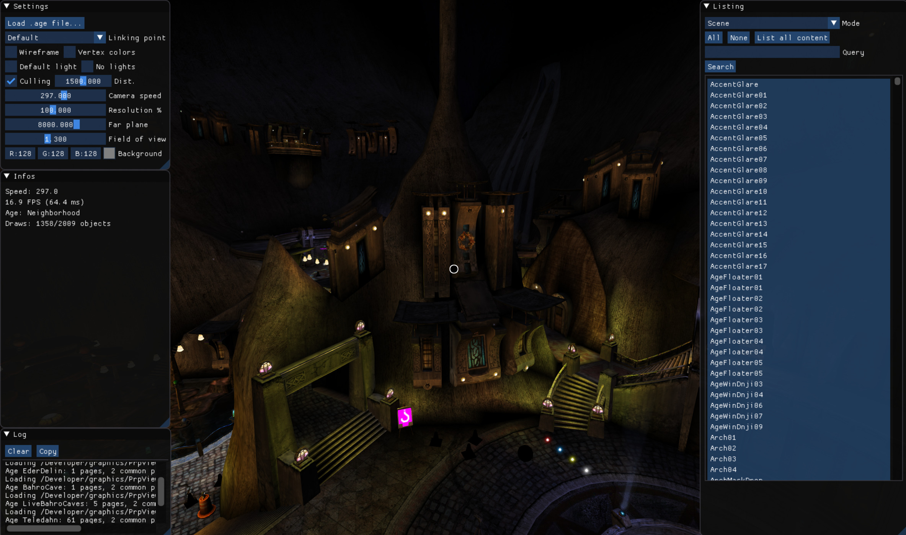

# PRPViewer

This is a realtime viewer for Uru and Myst V game assets. It relies on the open-sourced Plasma engine to load levels and extract enough information to perform realtime rendering. 

This project was tested on Windows and macOS. After cloning the repository, run `configure.bat` or `configure.sh` depending on your environment to build and setup all dependencies. You can then use Cmake to generate the main project from the repository root.

More information in this series of blog posts:

* [Coming back to Uru, part 1](http://blog.simonrodriguez.fr/articles/10-04-2018_coming_back_to_uru.html)  
* [Coming back to Uru, part 2](http://blog.simonrodriguez.fr/articles/22-04-2018_coming_back_to_uru_part_2.html)  
* [Coming back to Uru, part 3](http://blog.simonrodriguez.fr/articles/25-10-2018_coming_back_to_uru_part_3.html )  
* [Coming back to Uru, part 4](http://blog.simonrodriguez.fr/articles/02-11-2018_coming_back_to_uru_part_4.html)

# License
Libraries in `src/libs/*` and `external/*` remain under their respective licenses.
This work is based on the awesome [libhsplasma](https://github.com/H-uru/libhsplasma) project, licensed under GPLv3. PRPViewer is thus also licensed under the [GPLv3](https://github.com/kosua20/PRPViewer/blob/master/LICENSE).
